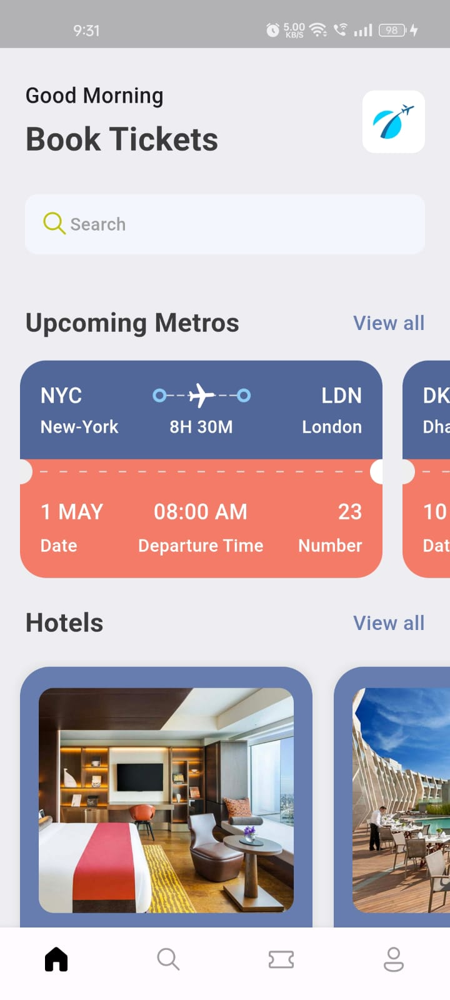
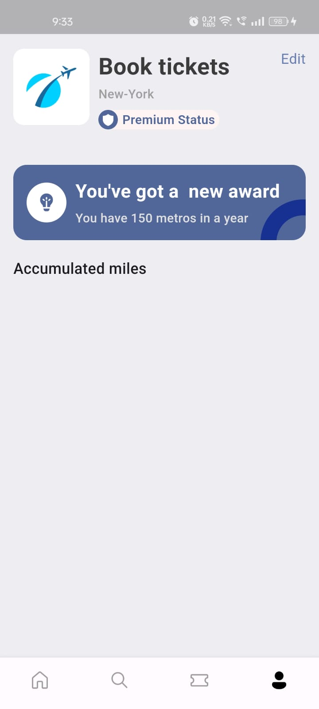
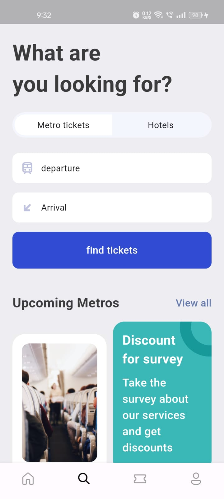
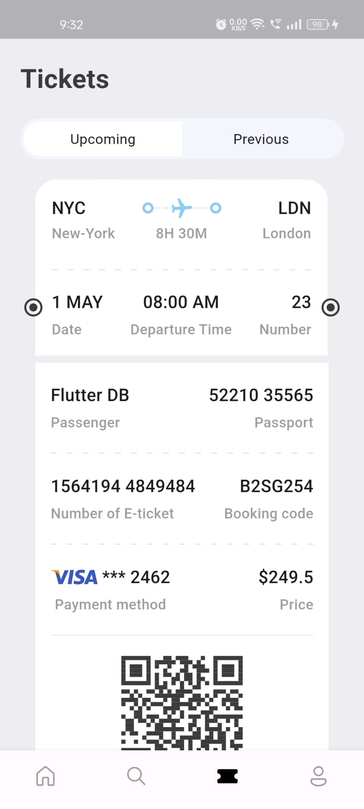

# Ticket Booking App UI

## Overview
This project is a Flutter-based ticket booking application user interface (UI) designed to provide users with a seamless and intuitive ticket booking experience. The UI includes screens for browsing events, selecting seats, viewing booking details, and completing the payment process.

## Features
- **Sleek UI Design:** Crafted with modern design principles and material design guidelines for an appealing visual experience.
- **Responsive Layouts:** Ensured responsiveness across various screen sizes and orientations to maintain consistency.
- **Interactive Widgets:** Utilized Flutter's customizable widgets to create interactive elements for enhanced user engagement.
- **Documentation:** Documented UI design specifications, component guidelines, and best practices for future reference.

## Screenshots
<!-- Add screenshots of your UI here -->

<!-- Add more screenshots as needed -->

## Getting Started
To get started with this project, follow these steps:
1. Clone this repository to your local machine.
2. Open the project in your preferred Flutter development environment.
3. Run the project on an emulator or physical device to preview the ticket booking app UI.

## Technologies Used
- Flutter
- Dart
- Git (Version Control)

## Contributors
- [Your Name](link to your GitHub profile) - Project Lead & UI Developer

## License
This project is licensed under the [MIT License](/path/to/LICENSE).

## Acknowledgments
- Special thanks to the Flutter community for their valuable resources and support.
